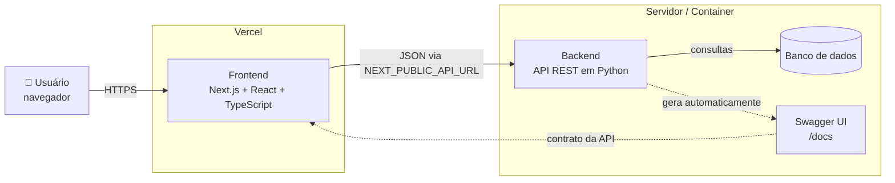
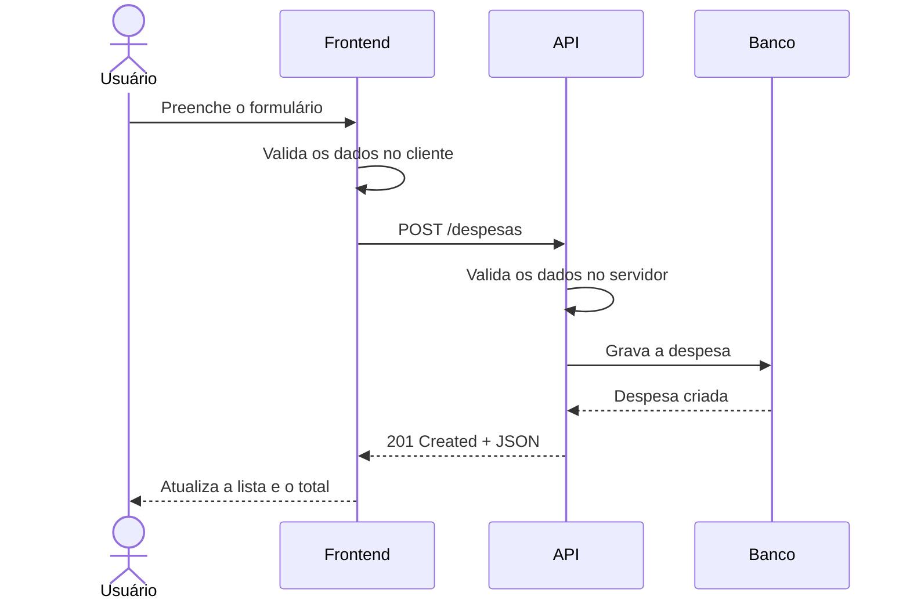
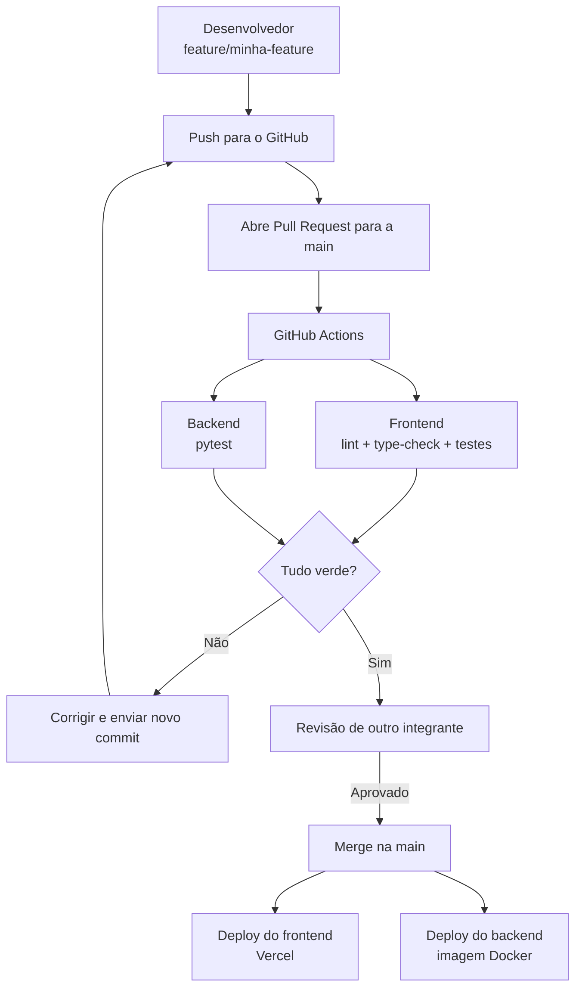
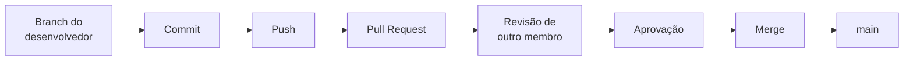

# 💰 Sistema de Gestão de Despesas

Sistema desenvolvido com o objetivo de facilitar o **controle e gerenciamento de despesas pessoais**, permitindo o cadastro, acompanhamento e organização de gastos de forma simples e intuitiva.

O projeto será desenvolvido utilizando **Next.js/React no frontend**, **Python no backend** e **Node.js no ambiente de desenvolvimento e gerenciamento das dependências do frontend**.

## 👥 Integrantes

| Integrante                    | Responsabilidades      |
| ----------------------------- | ---------------------- |
| **Marco Renzo**               | UI/UX, Backend e QA    |
| **Gabriel Texeira**           | Frontend e QA          |
| **Paulo Vicente**             | DevOps, CI/CD e QA     |
| **André Dias Balbino**        | Frontend, Backend e QA |
| **João Victor Siécola Souza** | Frontend, Backend e QA |


## 🚀 Objetivo do Projeto

Desenvolver uma aplicação web para gerenciamento de despesas, permitindo que o usuário tenha maior controle sobre seus gastos e consiga visualizar suas informações financeiras de maneira organizada.

Entre as funcionalidades previstas estão:

* Cadastro de despesas;
* Edição de despesas;
* Exclusão de despesas;
* Listagem de despesas;
* Categorização de gastos;
* Filtros por período e categoria;
* Visualização do total de despesas;
* Dashboard para acompanhamento dos gastos;
* Interface responsiva e de fácil utilização.

---

## 🛠️ Tecnologias

### Frontend

* React
* TypeScript
* tailwind
* shadcn/ui
* Node.js
* pnpm

### Backend

* Python
* API REST
* Swagger / OpenAPI

### DevOps

* Git
* GitHub
* CI/CD
* Docker
* Vercel

---

## 🏗️ Arquitetura

O sistema é dividido em duas aplicações independentes que conversam por **HTTP/JSON**.
O frontend não acessa o banco de dados diretamente: tudo passa pela API.



### Como as partes se comunicam

Exemplo do cadastro de uma despesa, do clique até a tela atualizada:



A validação acontece **dos dois lados**: no frontend para dar retorno imediato ao
usuário, e no backend porque a API pode ser chamada por qualquer cliente.

---

## 📖 API e Documentação (Swagger)

A API é documentada com **Swagger / OpenAPI**. A documentação é gerada a partir do
próprio código, então ela nunca fica desatualizada em relação aos endpoints reais.

| Rota            | Para que serve                                     |
| --------------- | -------------------------------------------------- |
| `/docs`         | Swagger UI — permite testar os endpoints pelo navegador |
| `/redoc`        | Mesma documentação em formato de leitura            |
| `/openapi.json` | Contrato da API em JSON                             |

Isso desacopla o time: quem trabalha no frontend consulta o `/docs` para saber o
formato de cada requisição, sem precisar ler o código do backend.

Endpoints previstos:

| Método   | Rota              | Descrição                    |
| -------- | ----------------- | ---------------------------- |
| `GET`    | `/despesas`       | Lista as despesas            |
| `POST`   | `/despesas`       | Cadastra uma despesa         |
| `PUT`    | `/despesas/{id}`  | Edita uma despesa            |
| `DELETE` | `/despesas/{id}`  | Exclui uma despesa           |
| `GET`    | `/categorias`     | Lista as categorias          |

---

## 📁 Estrutura Inicial do Projeto

```text
Sistema-de-Gestao-Despesas/
│
├── frontend/
│   ├── src/
│   │   ├── app/         # Rotas (App Router)
│   │   ├── components/  # Componentes de UI
│   │   ├── hooks/       # Estado compartilhado
│   │   ├── lib/         # Regras de negócio + testes
│   │   └── types/       # Tipos do domínio
│   ├── public/
│   └── package.json
│
├── backend/
│   ├── src/
│   ├── tests/
│   └── requirements.txt
│
├── .github/
│   └── workflows/
│
├── .gitignore
└── README.md
```

A estrutura poderá ser alterada durante o desenvolvimento conforme as necessidades do projeto.

---

## 🧪 Testes

O projeto será desenvolvido de forma que suas principais funcionalidades possam ser testadas futuramente.

Inicialmente serão criadas pequenas funcionalidades independentes, permitindo a implementação de testes unitários e de integração durante a evolução do projeto.

No frontend os testes rodam com **Vitest** e **Testing Library**:

```bash
cd frontend
pnpm test
```

Funcionalidades já cobertas por testes:

* Validação de valores de despesas;
* Cadastro de despesas (unitário e de componente);
* Cálculo do total de despesas;
* Filtro de despesas por categoria e por período;
* Agrupamento de gastos por categoria.

---

## 🔄 Pipeline de CI/CD

Nenhuma alteração entra na `main` sem passar pelos testes automatizados e pela
revisão de outro integrante.



---

## 📦 Gerenciamento de Dependências

O projeto utilizará arquivos específicos para gerenciamento das dependências.

### Frontend

```text
package.json
```

Responsável pelo gerenciamento das dependências do Next.js e Node.js.
O `pnpm-lock.yaml` fixa as versões — use sempre `pnpm`, nunca `npm` ou `yarn`.

### Backend

```text
requirements.txt
```

Responsável pelas dependências Python utilizadas pela API.

---

## 🌿 Organização do Git

Cada integrante deverá trabalhar utilizando sua própria branch.

Exemplo:

```bash
git checkout -b feature/nome-da-feature
```

Os commits deverão seguir boas práticas de escrita.

Exemplos:

```bash
git commit -m "feat: adiciona cadastro de despesas"
```

```bash
git commit -m "feat: cria estrutura inicial do frontend"
```

```bash
git commit -m "feat: adiciona API de despesas"
```

```bash
git commit -m "ci: adiciona pipeline de integração contínua"
```

```bash
git commit -m "docs: atualiza documentação do projeto"
```

---

## 🔀 Pull Requests

Cada integrante deverá realizar **no mínimo um commit** no projeto.

As alterações deverão ser enviadas através de uma branch e posteriormente abertas como **Pull Request**.

O Pull Request deverá ser revisado e aprovado por **outro integrante do grupo** antes de ser integrado à branch `main`.

Fluxo esperado:



---

## ✅ Requisitos da Entrega Inicial

Para esta primeira etapa do projeto deverão ser atendidos os seguintes requisitos:

* [x] Definição do projeto;
* [x] Definição das tecnologias;
* [x] Definição inicial da arquitetura;
* [x] Definição das responsabilidades dos integrantes;
* [x] Criar estrutura inicial de pastas;
* [x] Desenvolver pelo menos uma pequena funcionalidade testável;
* [ ] Criar `requirements.txt`;
* [x] Criar `package.json`;
* [ ] Cada integrante realizar pelo menos 1 commit;
* [ ] Cada alteração ser enviada através de Pull Request;
* [ ] Pull Requests serem aprovados por outro integrante;
* [ ] Configurar CI/CD inicial.

---

## 📌 Status do Projeto

🚧 **Em desenvolvimento**

Primeira etapa focada na definição da arquitetura, organização do repositório, criação das primeiras funcionalidades e configuração do fluxo de desenvolvimento utilizando Git, Pull Requests e CI/CD.
