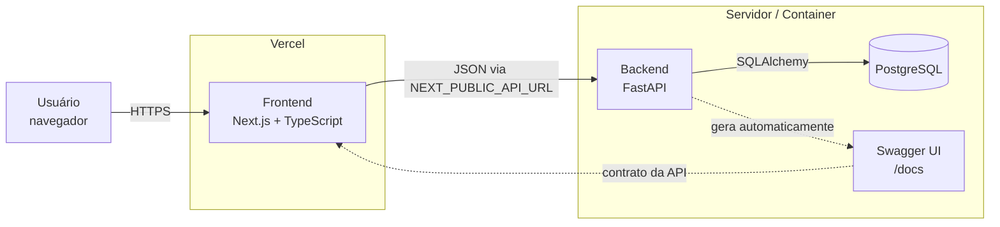
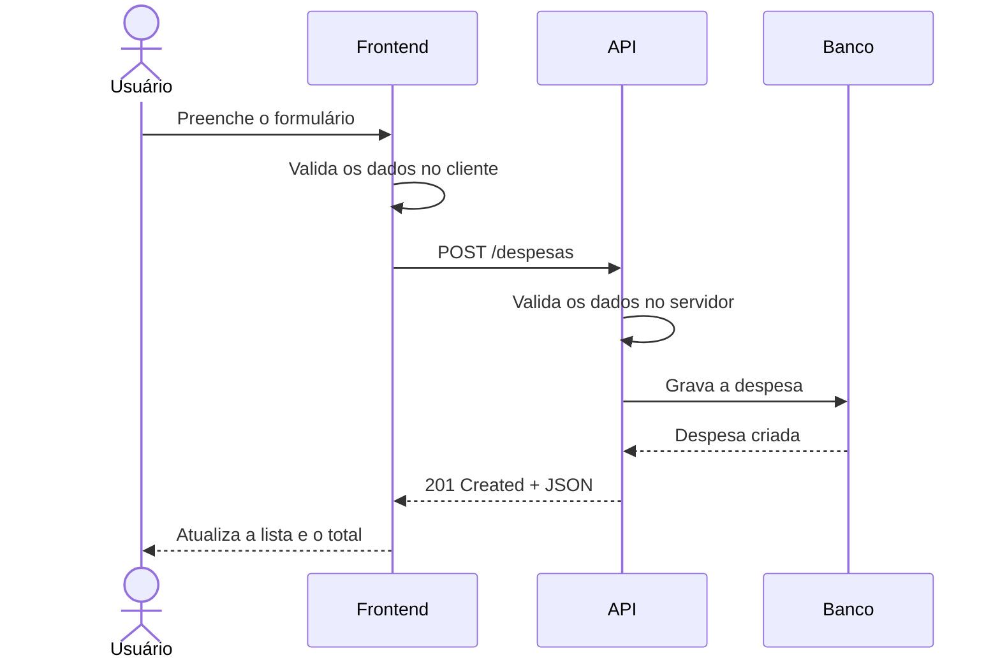
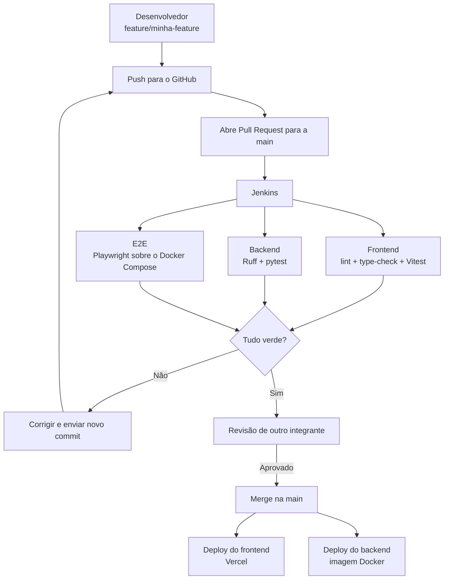

# Sistema de Gestão de Despesas

Aplicação web para controle de despesas pessoais: cadastro, categorização, filtros por período e acompanhamento dos gastos.

Frontend em Next.js hospedado na Vercel, backend em Python com API REST.

## Integrantes

| Integrante                    | Responsabilidades      |
| ----------------------------- | ---------------------- |
| **Marco Di Toro**               | UI/UX, Backend e QA    |
| **Gabriel Texeira**           | Frontend e QA          |
| **Paulo Vicente**             | DevOps, CI/CD e QA     |
| **André Dias Balbino**        | Frontend, Backend e QA |
| **João Victor Siécola Souza** | Frontend, Backend e QA |

## Objetivo

Permitir que o usuário registre seus gastos e visualize suas informações financeiras de forma organizada.

Funcionalidades previstas:

* Cadastro, edição, exclusão e listagem de despesas;
* Categorização de gastos;
* Filtros por período e categoria;
* Visualização do total de despesas;
* Dashboard para acompanhamento;
* Interface responsiva.

---

## Tecnologias

### Frontend

* Next.js
* React
* TypeScript
* Tailwind CSS
* shadcn/ui
* Node.js
* pnpm

### Backend

* Python
* FastAPI
* SQLAlchemy
* Alembic
* PostgreSQL
* Swagger / OpenAPI
* Ruff

### Testes

* Vitest
* pytest
* Playwright
* Postman

### DevOps

* Git e GitHub
* Jenkins
* Docker e Docker Compose
* Vercel

---

## Arquitetura

O sistema é dividido em duas aplicações independentes que conversam por HTTP/JSON. O frontend não acessa o banco diretamente: tudo passa pela API.



### Fluxo de uma requisição

Cadastro de uma despesa, do clique até a tela atualizada:



A validação acontece dos dois lados: no frontend para dar retorno imediato ao usuário, e no backend porque a API pode ser chamada por qualquer cliente.

---

## API e documentação

O FastAPI gera a documentação a partir do próprio código, então ela não desatualiza em relação aos endpoints reais. Quem trabalha no frontend consulta o `/docs` para saber o formato de cada requisição, sem precisar ler o código do backend.

| Rota            | Para que serve                                   |
| --------------- | ------------------------------------------------ |
| `/docs`         | Swagger UI, permite testar os endpoints no navegador |
| `/openapi.json` | Contrato da API em JSON                          |

Endpoints previstos:

| Método   | Rota             | Descrição            |
| -------- | ---------------- | -------------------- |
| `GET`    | `/despesas`      | Lista as despesas    |
| `POST`   | `/despesas`      | Cadastra uma despesa |
| `PUT`    | `/despesas/{id}` | Edita uma despesa    |
| `DELETE` | `/despesas/{id}` | Exclui uma despesa   |
| `GET`    | `/categorias`    | Lista as categorias  |

---

## Estrutura do projeto

```text
Sistema-de-Gestao-Despesas/
│
├── frontend/
│   ├── src/
│   │   ├── app/         # Rotas (App Router)
│   │   ├── components/  # Componentes de UI
│   │   ├── hooks/       # Estado compartilhado
│   │   ├── lib/         # Regras de negócio
│   │   ├── tests/       # Testes Vitest (components, data, lib)
│   │   └── types/       # Tipos do domínio
│   ├── public/
│   ├── Dockerfile
│   └── package.json
│
├── backend/
│   ├── src/
│   ├── tests/
│   ├── alembic/         # Migrações do banco
│   └── requirements.txt
│
├── docker-compose.yml
├── Jenkinsfile
├── .gitignore
└── README.md
```

---

## Testes

| Camada              | Ferramenta               | O que cobre                          |
| ------------------- | ------------------------ | ------------------------------------ |
| Unitário (frontend) | Vitest + Testing Library | Regras de negócio e componentes      |
| Unitário (backend)  | pytest                   | Validações e regras da API           |
| Integração (API)    | pytest + `TestClient`    | Endpoints reais, requisição/resposta |
| Ponta a ponta       | Playwright               | Fluxos completos no navegador        |
| Exploratório        | Postman                  | Testes manuais e demonstração        |

O `TestClient` do FastAPI usa httpx por baixo, então os testes de integração batem nos endpoints de verdade sem precisar subir um servidor. A collection do Postman deve ser importada do `/openapi.json`, para não ser mantida à mão quando a API mudar.

Rodando os testes do frontend:

```bash
cd frontend
pnpm install
pnpm test
```

Rodando o frontend em desenvolvimento:

```bash
cd frontend
pnpm install
pnpm dev
```

Se o comando `pnpm` não for reconhecido no Windows, instale uma vez com:

```bash
npm install -g pnpm
```

Abra `http://localhost:3000`. Na primeira visita o app carrega despesas mock no `localStorage` para facilitar a demonstração (cadastro, filtros, exclusão e totais).

Rodando os testes do backend:

```bash
cd backend
pip install -r requirements.txt
pytest
```

Funcionalidades já cobertas:

* Validação de valores de despesas;
* Cadastro de despesas (unitário e de componente);
* Listagem, exclusão e estados vazios (componente);
* Cálculo do total de despesas e resumo por categoria (domínio e componente);
* Filtro de despesas por categoria e por período (domínio e componente);
* Mock inicial.

---

## Pipeline de CI/CD

Nenhuma alteração entra na `main` sem passar pelos testes automatizados e pela revisão de outro integrante.



---

## Dependências

| Parte    | Arquivo                            | Observação                                        |
| -------- | ---------------------------------- | ------------------------------------------------- |
| Frontend | `package.json`, `pnpm-lock.yaml`   | Use sempre `pnpm`; o lockfile é dele              |
| Backend  | `requirements.txt`                 | Instalado com `pip install -r requirements.txt`   |

As mudanças no banco são versionadas com Alembic: toda alteração de tabela vira um arquivo de migração commitado junto com o código, e os integrantes atualizam o banco local com um comando.

```bash
alembic upgrade head
```

---

## Fluxo de trabalho

Cada integrante trabalha na própria branch e envia as alterações por Pull Request, que precisa ser aprovado por **outro integrante** antes do merge na `main`. Cada integrante deve fazer no mínimo um commit no projeto.

```bash
git checkout -b feature/nome-da-feature
```

Os commits seguem o padrão Conventional Commits:

```bash
git commit -m "feat: adiciona cadastro de despesas"
git commit -m "fix: corrige cálculo do total"
git commit -m "ci: adiciona pipeline do Jenkins"
git commit -m "docs: atualiza documentação"
```

---

## Requisitos da Entrega Inicial

* [x] Definição do projeto;
* [x] Definição das tecnologias;
* [x] Definição inicial da arquitetura;
* [x] Definição das responsabilidades dos integrantes;
* [x] Criar estrutura inicial de pastas;
* [x] Desenvolver pelo menos uma pequena funcionalidade testável;
* [x] Criar `requirements.txt`;
* [x] Criar `package.json`;
* [ ] Cada integrante realizar pelo menos 1 commit;
* [ ] Cada alteração ser enviada através de Pull Request;
* [ ] Pull Requests serem aprovados por outro integrante;
* [x] Configurar CI/CD inicial.

---

## Status

Em desenvolvimento. Primeira etapa focada na definição da arquitetura, organização do repositório, primeiras funcionalidades testáveis e configuração do fluxo de Git, Pull Requests e CI/CD.
